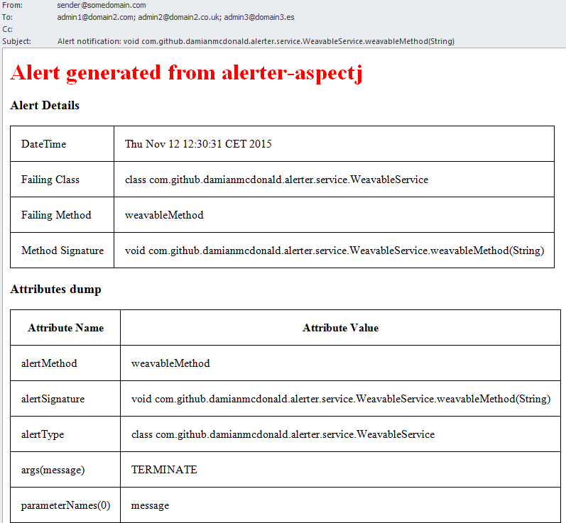

:source-highlighter: coderay
:data-uri:

`alerter-aspectj` is a small java application that demonstrates Load Time Weaving using https://eclipse.org/aspectj/[AspectJ].

The application provides an `aop.xml` file in which concrete aspects can be defined, containing `pointcuts` of the expressions to weave.

When one of the weaved classes executes, the `AbstractAlertAspect` (the super class of the concrete aspects) will inspect the watched method execution. If the weaved method generates an exception, the aspect will send an alert email to an admin telling them of the timestamp of the failure, the signature of the failing method along with a dump of the state of the method arguments at the point of the exception.

== Getting started

The library was built using the following toolchain:

* http://www.oracle.com/technetwork/java/javase/downloads/index.html[Java Oracle JDK 1.7]
* https://maven.apache.org/download.cgi[Maven 3.2.3]

Your mileage may vary with versions different than the ones specified above.

Follow these steps to get started:

1) Git-clone this repository.

----
$ git clone git://github.com/damianmcdonald/alerter-aspectj.git my-project
----

2) Change directory into your clone:

----
$ cd my-project
----
    
3) Use Maven to compile and execute the app:

----
$ mvn clean package exec:java
----

== Configuration

alerter-aspectj contains 2 configuration files; `aop.xml` and `alerter.properties`.

The intention with alerter-aspectj is that the application can be configured via these two files without the need to modify any source code.

=== aop.xml

The `aop.xml` configuration file is located within `src/main/resources/META-INF/aop.xml`.

`aop.xml` is used to define concrete aspects. These concrete aspects define a point cut which includes an expression of a package, class, interface or method to weave (monitor).

[source,xml]
.aop.xml
----
<aspectj>
   <aspects>
     <concrete-aspect name="com.github.damianmcdonald.alerter.ConcreteAspect1" extends="com.github.damianmcdonald.alerter.aspects.AbstractAlertAspect">
            <pointcut name="alertMethod" expression="execution(* com.github.damianmcdonald.alerter.service.WeavableService.*(..))" />
        </concrete-aspect>
   </aspects>
   
   <weaver options="-verbose -debug -showWeaveInfo">
   </weaver>
</aspectj>
----

Some tips for configuring `aop.xml`:

* Ensure that the concrete-aspect name is unique
* The concrete-aspect must extend eu.ohim.sp.alerter.aspects.AbstractAlertAspect
* The pointcut name must be alertMethod
* Customize the pointcut expression for your needs

In order to learn more about Concrete Aspects and PointCut expressions, see the links below:

* https://eclipse.org/aspectj/doc/released/devguide/ltw-configuration.html
* https://guptavikas.wordpress.com/2010/04/15/aspectj-pointcut-expressions/
* http://howtodoinjava.com/2015/02/03/writing-spring-aop-aspectj-pointcut-expressions-with-examples/
* http://docs.spring.io/spring/docs/current/spring-framework-reference/html/aop.html#aop-common-pointcuts

=== alerter.properties

The `alerter.properties` configuration file is located within `src/main/resources/alerter.properties`.

`alerter.properties` is used to configure application level properties such as:

* email server configuration
* email subject
* email recipients
* email format (html or plaintext)
* velocity template engine settings

[source,properties]
.alerter.properties
----
#######################################
#                                     #
#     Generic mail configuration      #
#                                     #				
#######################################
# set this property to true if what you want to send emails. When set to false, emails will not be sent
mail.send=false
mail.host=localhost
mail.port=25
mail.from=sender@somedomain.com
# multiple recipients should separated by ,
mail.recipients=admin1@domain2.com,admin2@domain2.co.uk,admin3@domain3.es
# this is the subject that will appear in the alert email 
mail.subject=Alert notification: {0}

#######################################
#                                     #
#     Secure mail configuration       #
#                                     #				
#######################################
# set this property to true if you need to use secure email
mail.requires.auth=false
mail.enable.tls=false
# credentials required to logon to stmp server (only required if mail.requires.auth=true)
mail.username=username@gmail.com
mail.password=somepassword

#######################################
#                                     #
#       Velocity properties           #
#                                     #				
#######################################
# when this property is set to true, html emails will be sent via the alert_html.vm template
# when this property is set to false, plaintext emails will be sent via the alert_txt.vm template
mail.template.html=false
# only change the settings below if you want to alter the location of the velocity template files
resource.loader = class
class.resource.loader.class = org.apache.velocity.runtime.resource.loader.ClasspathResourceLoader
class.resource.loader.description = Load resources from the CLASSPATH
runtime.log.logsystem.class=org.apache.velocity.runtime.log.NullLogChute
----

== Conventions

alerter-aspectj utilises the following conventions:

* `alerter.properties`

Expected in `src/main/resources/alerter.properties` by convention. 

This file can be externalised by defining a java system property `alerter.properties` when the application is loaded. 

For example: `-Dalerter.properties=/opt/sp/conf/myalerter.properties`

* `aop.xml` 

Expected in `src/main/resources/META-INF/aop.xml` by convention. 

This file can be externalised by defining a java system property when the application is loaded.

For example: `-Dorg.aspectj.weaver.loadtime.configuration=com/github/damianmcdonald/alerter/aop.xml`

* velocity templates

The templates that are used to generate the alert emails are located in:

`src/main/resources/alert_html.vm` and `src/main/resources/alert_txt.vm`